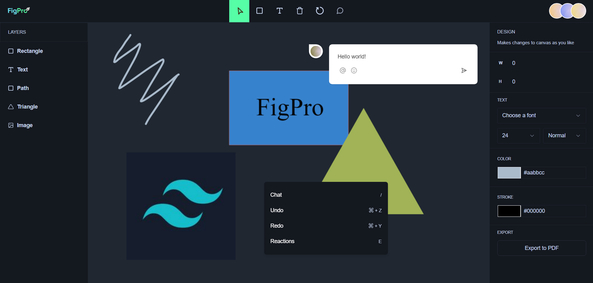

# FigPro



FigPro is a web-based collaborative design tool similar to Figma, built using Next.js, TypeScript, Tailwind CSS, and LiveBlocks API, Fabric.js. With FigPro, teams can seamlessly collaborate on designing interfaces in real-time with a plethora of features.

## Table of Contents

- [Demo](#demo)
- [Features](#features)
- [Technologies Used](#technologies-used)
- [Packages Used](#packages-used)
- [Environment Variables](#environment-variables)
- [Getting Started](#getting-started)
- [Folder Structure](#folder-structure)
- [Running the Application](#running-the-application)
- [Author](#author)
- [Documentation](#documentation)

## Demo

You can see a live demo of the portfolio website at https://fig-pro-github.vercel.app/.

## Features

- **Live Collaboration**: Multiple users can simultaneously work on the canvas, with live updates of cursor positions and changes.
- **Shape Manipulation**: Add, modify, and delete shapes such as rectangles, circles, triangles, and images. Customize properties like width, height, stroke color, border color, and fill color.
- **Free Drawing**: Utilize the pencil feature to free draw on the canvas.
- **Text Addition**: Add text to designs and adjust font size, weight, and style.
- **Copy and Paste**: Easily duplicate elements on the canvas by copying and pasting.
- **Comment Threads**: Users can add comments to specific elements, reply to them, and close threads.
- **Real-Time Updates**: All changes made to the canvas and comments are instantly updated for all users in real-time.
- **Undo/Redo**: Easily undo or redo actions using keyboard shortcuts (Ctrl+Z and Ctrl+Y).
- **Chat Bubbles**: Access chat bubbles for quick communication among team members.
- **Reactions**: Express reactions to designs using keyboard shortcuts.
- **Export to PDF**: Selected elements on the canvas can be exported to PDF format.

## Technologies Used

- **Next.js**: For server-side rendering and routing.
- **TypeScript**: To add static types to JavaScript.
- **Tailwind CSS**: Utility-first CSS framework for styling.
- **LiveBlocks API**: Real-time collaboration API for syncing data across clients.
- **Fabric.js**: HTML5 canvas library for manipulating graphics and interactive content.
- **Shadcn**: Component library for UI elements.

## Packages Used

- **@liveblocks/client**: LiveBlocks client library for real-time updates.
- **@liveblocks/node**: LiveBlocks server-side library.
- **@liveblocks/react**: React bindings for LiveBlocks.
- **@liveblocks/react-comments**: React component for adding comments.
- **@radix-ui/react-context-menu**: Context menu UI components.
- **@radix-ui/react-dropdown-menu**: Dropdown menu UI components.
- **@radix-ui/react-label**: Label UI components.
- **@radix-ui/react-select**: Select UI components.
- **@radix-ui/react-slot**: Slot UI components.
- **@types/fabric**: TypeScript definitions for Fabric.js.
- **fabric**: HTML5 canvas library.
- **jspdf**: JavaScript library for generating PDFs.
- **lucide-react**: SVG icon components.
- **uuid**: Library for generating UUIDs.
- **tailwind-merge**: Utility for merging Tailwind CSS classes.

## Environment Variables

The project relies on environment variables stored in a `.env.local` file located at the root of the `figpro` directory to manage configurations. Ensure that essential variables such as database connection strings, API keys, or any other sensitive information are properly set up.

```bash
NEXT_PUBLIC_LIVEBLOCKS_PUBLIC_KEY = "*YOUR LIVEBLOCKS API PUBLIC KEY*"
```

Be sure to replace `*YOUR LIVEBLOCKS API PUBLIC KEY*` with your actual LiveBlocks API public key to enable proper integration.

**Note**: Environment variables containing sensitive information like API keys, database credentials, or any other secrets should not be committed to version control. Ensure that the `.env` files are included in your project's `.gitignore` file to prevent accidental exposure of sensitive data.

### Getting started

1. Clone this repository to your local machine:

```bash
git clone https://github.com/Shivam-Sharma-1/FigPro.git
```

2. Change to the project directory:

```bash
cd figpro
```

3. Install and run client dependencies:

```bash
npm install
npm run dev
```

Open your web browser and visit http://localhost:3000 to see the website in action during development.

## Folder Structure

```
figpro/
├── app/                # Next.js pages
├── components/         # React components
├── constants/          # Constants or configurations
├── hooks/              # Custom hooks
├── lib/                # Utility functions or external libraries
└── public/             # Public assets
```

## Running the Application

1. Start the development server: `npm run dev`
2. Open your browser and navigate to `http://localhost:3000`

## Author

- [@Shivam-Sharma-1](https://github.com/Shivam-Sharma-1)

## Documentation

- **[Next.js Documentation](https://nextjs.org/docs/getting-started)**: Learn more about Next.js for server-side rendering and routing.
- **[TypeScript Documentation](https://www.typescriptlang.org/docs/)**: Explore TypeScript documentation for adding static types to JavaScript.
- **[Tailwind CSS Documentation](https://tailwindcss.com/docs)**: Dive into Tailwind CSS documentation for utility-first CSS styling.
- **[LiveBlocks API Documentation](https://liveblocks.io/docs/)**: Refer to LiveBlocks API documentation for real-time collaboration.
- **[Fabric.js Documentation](http://fabricjs.com/docs/)**: Discover Fabric.js documentation for HTML5 canvas manipulation.
- **[Shadcn Documentation](https://ui.shadcn.com/docs)**: Comprehensive documentation for the Shadcn component library, offering a wide range of customizable UI components to enhance your web application's user interface.

This section provides links to the documentation pages of the technologies used in the project for further exploration and learning.

---

Feel free to adjust any sections or details according to your preferences!
